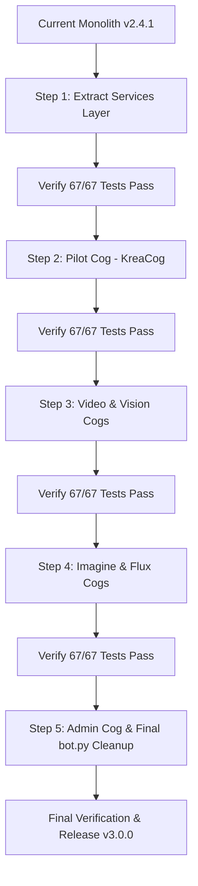

# 🏗️ Phase 3 Architecture Blueprint: Modular Cog Overhaul

**Target Architecture:** Discord.py Modular Cogs (`commands.Cog`) & Extracted Execution Services  
**Objective:** Decompose the 6,900+ line monolithic [`bot.py`](bot.py) into specialized, maintainable modules without breaking existing commands, button callbacks, database persistence, or test suites.

---

## 1. High-Level Vision: Before vs. After

### Current State (Monolith)
* [`bot.py`](bot.py) contains:
  * Global variables & environment config (~200 lines)
  * ComfyUI client lifecycle & memory hooks (~150 lines)
  * Central interaction router `on_interaction` (~600 lines)
  * Slash command definitions (~2,000 lines)
  * Modal callbacks & button responses (~1,500 lines)
  * Heavy generation pipelines (`execute_imagine`, `execute_bertflow`, `execute_video`) (~2,500 lines)
* **Pain Points:** Hard to navigate, high risk of git merge conflicts, difficult to isolate issues in one engine (e.g. Krea 2) from another (e.g. Wan Video).

### Target State (Modular Cogs + Service Layer)
```
Shallot-cui-bot/
├── bot.py                     # Slim entry point (~300 lines): client init, cog loader, error hooks
├── cogs/                      # Discord Slash Command & UI Definitions
│   ├── __init__.py
│   ├── imagine_cog.py         # /imagine, /vary, /upscale, quadrant buttons
│   ├── krea_cog.py            # /bertflow, /blend-krea, Krea 2 action controls
│   ├── flux_cog.py            # /flux flow-matching generation
│   ├── video_cog.py           # /video, /ltx Wan 2.2 animation pipeline
│   ├── vision_cog.py          # /describe, /blend, /study Florence-2 studio
│   └── admin_cog.py           # /cui-start, /cui-stop, /cui-status, /free, /models, /prompt, /style
├── services/                  # Pure Python Business & ComfyUI Execution Logic
│   ├── __init__.py
│   ├── imagine_service.py     # SDXL multi-stage generation, grid creation, upscaling
│   ├── krea_service.py        # Bertflow & Krea 2 flow-matching pipelines
│   ├── video_service.py       # Wan 2.2 GGUF + RIFE interpolation pipeline
│   └── vision_service.py      # Florence-2 analysis & prompt extraction
├── characters.py              # Central character registry & autocomplete provider
├── model_architecture.py      # Cross-architecture taxonomy & safetensors guard
├── parsers.py                 # Workflow mutation & prompt parsing
├── views.py                   # Discord interactive views (Buttons, Modals, Selects)
├── comfy_client.py            # Async WebSocket ComfyUI client
├── db.py                      # SQLite persistence & metrics
└── suite_test.py              # Automated test harness
```

---

## 2. Critical Gotchas & Risk Mitigations

### Gotcha A: Circular Imports
* **The Danger:** A cog in `cogs/` needs `comfy_client` from `bot.py`, while `bot.py` imports the cog. Python will throw `ImportError: cannot import name ... from partially initialized module`.
* **The Solution:** 
  1. Pass the `bot` instance into every Cog's `__init__(self, bot: commands.Bot)`.
  2. Attach shared singletons directly to `bot` (e.g., `bot.comfy_client = comfy_client`, `bot.db = db`).
  3. Keep service functions pure: pass parameters explicitly rather than relying on module-level globals.

### Gotcha B: Custom ID Button Callbacks (`on_interaction`)
* **The Danger:** `bot.py` handles persistent custom IDs (like `bertflow_reroll:{id}`, `set_blend_krea_ar:{id}:{ar}`, `U1-U4`) inside `on_interaction`. Moving command code must not break active button listeners.
* **The Solution:** 
  * Keep the central `on_interaction` delegator in `bot.py` (or a dedicated `interaction_router.py`), and have it call the service functions (`krea_service.handle_bertflow_reroll()`, etc.).
  * Because custom IDs are stored in SQLite and stateless, button routing remains 100% backward-compatible.

### Gotcha C: Test Suite Backward Compatibility
* **The Danger:** `suite_test.py` imports directly from `bot.py` (`from bot import execute_bertflow, execute_imagine, handle_reroll`).
* **The Solution:** 
  * Re-export all extracted service functions in `bot.py`:
    ```python
    # Backward compatibility re-exports for tests and legacy callers
    from services.krea_service import execute_bertflow, handle_bertflow_reroll, handle_bertflow_toggle_char
    from services.imagine_service import execute_imagine, handle_upscale, handle_variation
    ```
  * Running `suite_test.py` will continue to pass without changing a single line of test code.

### Gotcha D: Autocomplete Decorators Inside Cogs
* **The Danger:** Outside cogs, autocomplete is registered as `@command.autocomplete('param')`. Inside a `commands.Cog`, the slash command is an attribute on `self`.
* **The Solution:**
  ```python
  class KreaCog(commands.Cog):
      def __init__(self, bot):
          self.bot = bot

      @app_commands.command(name="bertflow", description="...")
      async def bertflow_command(self, interaction: discord.Interaction, prompt: str, ...):
          ...

      @bertflow_command.autocomplete("character")
      async def bertflow_character_autocomplete(self, interaction: discord.Interaction, current: str):
          return get_character_autocomplete_choices(current, Architecture.KREA2)
  ```

---

## 3. Step-by-Step Execution Playbook

Execute the overhaul in **5 incremental, test-verified phases**. Do NOT attempt all steps in one go.



### Step 1: Create `services/` and Extract Business Logic (Zero Discord Changes)
1. Create `services/krea_service.py`:
   - Move `execute_bertflow`, `execute_blend_krea_core`, `handle_bertflow_reroll`, `handle_bertflow_toggle_char`, `handle_bertflow_upscale`.
2. Create `services/video_service.py`:
   - Move `execute_video_generation`, `execute_ltx_generation`.
3. In `bot.py`, import and re-export all functions from `services/`.
4. **Verification Checkpoint:** Run `python suite_test.py`. Must pass 67/67 tests cleanly.

### Step 2: Pilot Cog — `cogs/krea_cog.py`
1. Create `cogs/krea_cog.py`:
   - Implement `class KreaCog(commands.Cog)`.
   - Move `/bertflow` and `/blend-krea` commands into `KreaCog`.
   - Move their autocomplete handlers into the cog.
   - Add async setup hook:
     ```python
     async def setup(bot: commands.Bot):
         await bot.add_cog(KreaCog(bot))
     ```
2. In `bot.py`, add cog loader in `on_ready()` or startup:
   ```python
   await bot.load_extension("cogs.krea_cog")
   ```
3. **Verification Checkpoint:** Run `python suite_test.py`. Verify `bot.tree.get_commands()` contains `bertflow` and `blend-krea`.

### Step 3: Extract `cogs/video_cog.py` and `cogs/vision_cog.py`
1. Move `/video` and `/ltx` into `cogs/video_cog.py`.
2. Move `/describe`, `/blend`, and `/study` into `cogs/vision_cog.py`.
3. Load both extensions in `bot.py`.
4. **Verification Checkpoint:** Run `python suite_test.py`.

### Step 4: Extract Core Image Generation (`cogs/imagine_cog.py` & `cogs/flux_cog.py`)
1. Move `/imagine`, `/vary`, `/upscale`, and favorite style/prompt autocompletes into `cogs/imagine_cog.py`.
2. Move `/flux` into `cogs/flux_cog.py`.
3. Load both extensions in `bot.py`.
4. **Verification Checkpoint:** Run `python suite_test.py`.

### Step 5: Extract `cogs/admin_cog.py` & Slim Down `bot.py`
1. Move ComfyUI lifecycle commands (`/cui-start`, `/cui-stop`, `/cui-status`, `/free`, `/purge-vram`, `/queue`, `/models`, `/scan_models`) and prompt/style management commands into `cogs/admin_cog.py`.
2. Reduce `bot.py` to:
   - Environment and client initialization
   - Global error handling
   - `on_ready` event and dynamic `bot.load_extension()` loop across `cogs/`
   - `on_interaction` central router
   - `acquire_instance_lock()` singleton guard
3. **Verification Checkpoint:** Run `python suite_test.py`. Ensure total file size of `bot.py` is under 400 lines.

---

## 4. Rollback & Contingency Plan
* If any step introduces unexpected Discord command registration errors:
  1. Simply comment out the `await bot.load_extension("cogs.<failing_cog>")` in `bot.py`.
  2. The backward-compatible fallback implementations in `bot.py` remain untouched during each step until that specific step is verified.
  3. Git branch protection: Perform this refactoring on a dedicated branch (`git checkout -b refactor/modular-cogs`) so main remains 100% production-ready at all times.
